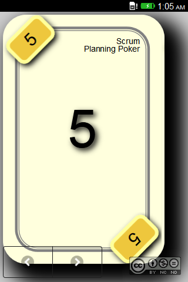
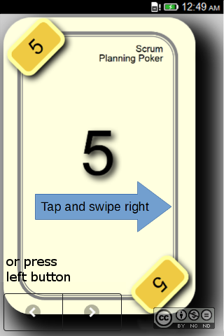
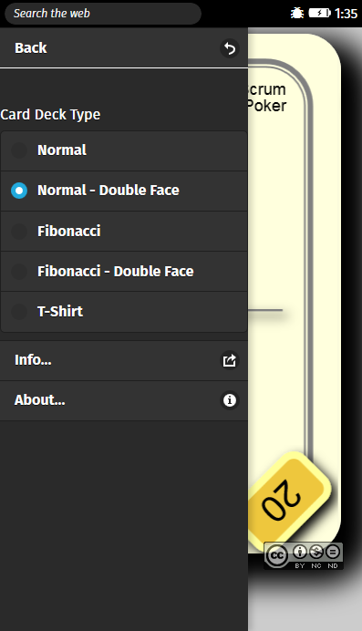
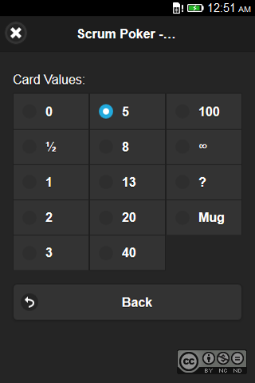
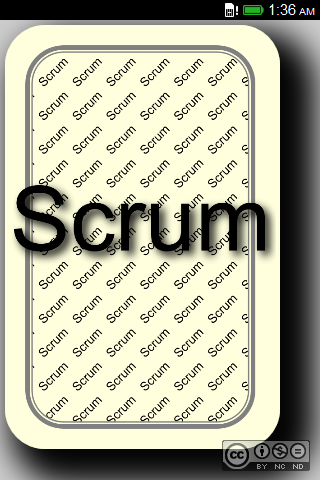
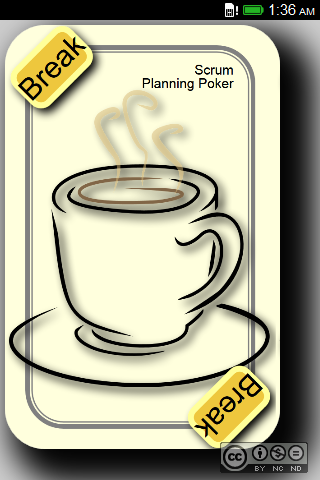

 Scrum Poker
====================

* <em>Start an online</em> <b>Scrum Poker</b> <em>session on</em> http://omerkel.github.io/Scrum-Poker/html5/src
* <em>Android APK available for install</em>  https://github.com/OMerkel/Scrum-Poker/releases/tag/release_0.3
    * requires minimum Android 4.4.2 (API-19)
* <em>Runs in various browsers on</em>
    * <em>desktop systems like BSDs, Linux, Win, MacOS and</em>
    * <em>mobile platforms like Android, FirefoxOS, iOS.</em>

__Keywords__ _SCRUM process framework_, _Scrum Poker Cards_, _Planning Poker Card Sets_, _estimation_, _complexity_, _agile_, _FirefoxOS_, _iOS (iPad / iPod / iPhone)_, _Android_, _Windows Phone_, _Linux_, _Desktop support_

Scrum Planning Poker supporting application for various Mobile Operating Systems, Tablets, and Desktop

Abstract
--------

In agile process environments a popular iterative and incremental approach for
  agile development and management of product development is <strong>SCRUM</strong>.
  One iterative aspect in <em>SCRUM</em> is the <em>Sprint</em> with its defined
  fixed cycle duration. Planning of <em>Sprint</em> cycles is performed by the
  <em>Team Members</em> in each cycle. While agreeing on scope and content of
  working <em>Tasks</em> derived from <em>Epics</em> and <em>Stories</em> in
  a <em>Sprint Backlog</em> the <em>Team</em> is in charge to come up with valid
  complexity and time estimates per <em>Task</em>.

This application provides a tool supporting a <em>Team</em> to find estimates for these
  <em>Tasks</em>. It can be used as a replacement for physical <em>SCRUM Planning Poker</em>
  card sets.

  
|  |  |  |
| --- | --- | --- |
| _The standard card view_ | _Swiping right to get to..._ | _... the Main menu, select Deck Type_ |

|  |  |  |  |
| --- | --- | --- | --- |
| _Swiping left to get to..._ | _... choose a card value_ | _Click card to toggle front and back face_ | _Indicating a break and more coffee is appreciated_ |

|  |  |  |  |
| --- | --- | --- | --- |
| _Successfully installed on Android_ | _Start icon on Android desktop_ | _Estimated to be a really huge task_ | _Indicating a break and more coffee is appreciated_ |

In Short
--------

At the beginning of your <em>SCRUM Planning Poker</em> find an agreement on the
  <strong>Card Deck Type</strong> to be used in your Poker session and select the
  corresponding valid card faces.

Swiping left from Main screen allows to select your desired card value.

Back on Main screen you can toggle the displayed card to show front face or the
  back face so that the card can be kept hidden with your hardware device screen
  facing up.

<strong>Mug</strong> selection shows a coffee mug indicating that a team member likes
  to go for a break. All other values indicate your personal estimate for the
  <em>Task's Complexity</em>. Enjoy...

Contributors / Authors
----------------------

<table>
  <tr>
    <td>
Oliver Merkel,  This image is licensed under a <a rel="license" href="http://creativecommons.org/licenses/by-nc-nd/4.0/">Creative Commons Attribution-NonCommercial-NoDerivatives 4.0 International License</a>.    
    

    </td>
    <td width="40%"></td>
  </tr>
</table>

_All logos, brands, and trademarks mentioned belong to their respective owners._
